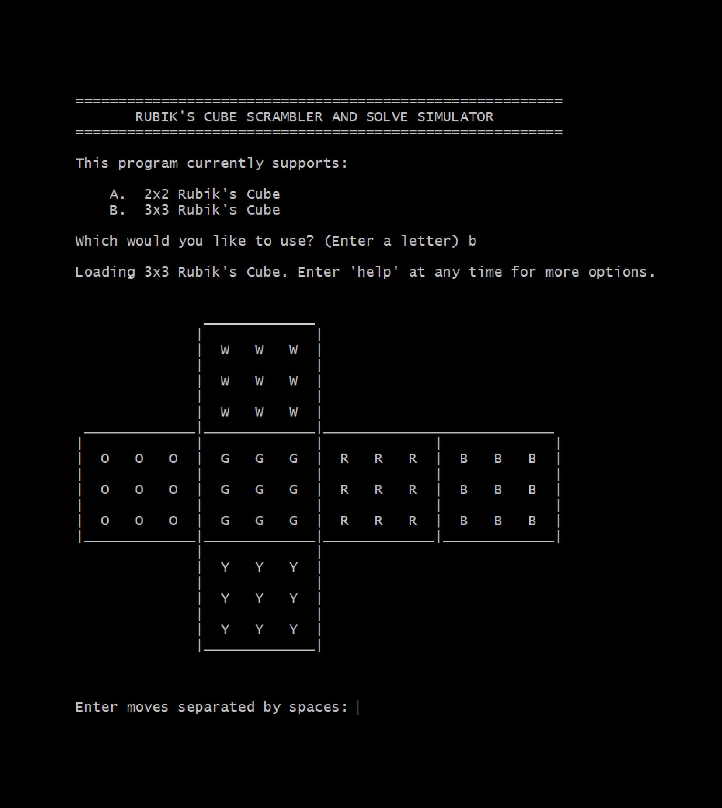

# Rubiks Cube Simulator
Command-line implementation of a 2x2 and 3x3 Rubik's Cube



### How to Use
Navigate to the project directory in the command line, then run
`python3 rubiks.py`

See [here](https://en.wikipedia.org/wiki/Rubik%27s_Cube#Move_notation) for a full description
of Singmaster notation for recording moves, used in this program to change the state of the cube.


To manipulate the cube, the program uses 
[Sigmaster notation](https://en.wikipedia.org/wiki/Rubik%27s_Cube#Move_notation). Here's an
overview of the most common letters:

| Face (relative location)  | CW Turn (90°) | CCW Turn (90°) | Half Turn (180°) |
| ------------------------- | ------------- | -------------- | ---------------- |
| Front                     | F             | F'             | F2               |
| Back                      | B             | B'             | B2               |
| Left                      | L             | L'             | L2               |
| Right                     | R             | R'             | R2               |
| Up                        | U             | U'             | U2               |
| Down                      | D             | D'             | D2               |

### About the Project
This is an upload of one of the first bigger Python programs I wrote that I put serious
effort into making the code organized and scalable. I believe I wrote the program in my
sophomore year of high school (around 2014-2015). Here's a bit of documentation I included in 
`rubiks.py` at the time I wrote it describing how the program works:

```
Cube State
----------
        Rather than trying to keep track of the permutation and orientation of each 
    individual piece, this program simulates the Rubik's Cube by storing the color of
    each sticker location on the cube.
    
        The state of the cube is kept track of using the dictionary CURRENT_CUBE_STATE_3.
    Each key is a position of a sticker on the cube, and their corresponsing values are
    "w", "g", "o", "r", "y", or "b" to indicate the color of the sticker in those
    positions. The sticker positions are denoted by a string of capital letters, one for
    centers, two for edges, or three for corners.
    
        Center pieces are simply referred to as the face they are on (L, R, F, B, U, or
    D). By convention, CURRENT_CUBE_STATE_3 assumes the green face as front and white on
    top, meaning position U will always be "w", position F will always be "green", etc.
    
        For edges, the first letter is simply the face the sticker is on. The second is
    the letter of the face closest to the sticker. In other words, the second letter can
    be determined by looking at the edge piece the sticker is on, and seeing what face
    the other sticker on that edge piece is on.
    
        Corners follow the same rule. The only thing to note is the order of the
    second two letters--the first letter is still the letter of the face it is on, but
    the second two letters are always ordered such that its left/right position comes
    before its up/down position when looking at the face the sticker is on. For
    example, the bottom left sticker on the front face would be labelled "FLD" as
    opposed to "FDL".
    
        The following is the complete lettering of positions on the cube's net where
    intersection is the front face:
    
                        __________________
                       |                  |
                       |  ULB   UB   URB  |
                       |                  |
                       |  UL    U    UR   |
                       |                  |
                       |  ULF   UF   URF  |
     ___________________________________________________________________________
    |                  |                  |                  |                  |
    |  LBU   LU   LFU  |  FLU   FU   FRU  |  RFU   RU   RBU  |  BRU   BU   BLU  |
    |                  |                  |                  |                  |
    |  LB    L    LF   |  FL    F    FR   |  RF    R    RB   |  BR    B    BL   |
    |                  |                  |                  |                  |
    |  LBD   LD   LFD  |  FLD   FD   FRD  |  RFD   RD   RBD  |  BRD   BD   BLD  |
     ___________________________________________________________________________
                       |                  |
                       |  DLF   DF   DRF  |
                       |                  |
                       |  DL    D    DR   |
                       |                  |
                       |  DLB   DB   DRB  |
                        __________________
```

More nitty-gritty details can be found near the top of `rubiks.py`.

### In Retrospect
Looking back on the program now, I would definitely choose to implement some things
differently. For example, the nature of the problem lends itself to follow
an object-oriented design. While I had experience in OOP at the time, I remember
choosing not to use a class hierarchy because there did not seem to be an intuitive
way to structure it. To be clear, a representation of a 2x2 Rubik's Cube is not a
subset of that of a 3x3 Rubik's cube.

However, I had not yet learned about abstract classes. Now the program structure 
would be clear to me: I would likely use a `Cube` class that extends Python's 
builtin AbstractBaseClass implementation, `abc.ABC`. Then `move` methods to perform
scrambles could be declared in `Cube` using `abstractmethod`s, then defined in its
subclasses.

Additionally, although I have always loved Python, whenever I find myself needing 
abstraction in a project, my instinct now is that it would be much more pleasant to
use Java, which comes with all the benefits (if only from a smart IDE like IntelliJ)
of static typing.

<sub><sup>Copyright © 2021 Jackson Hall. All rights reserved.</sup></sub>